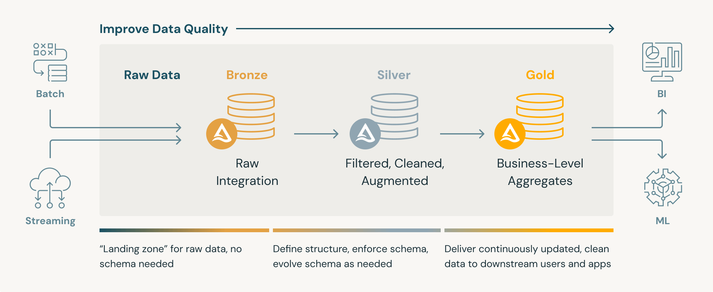
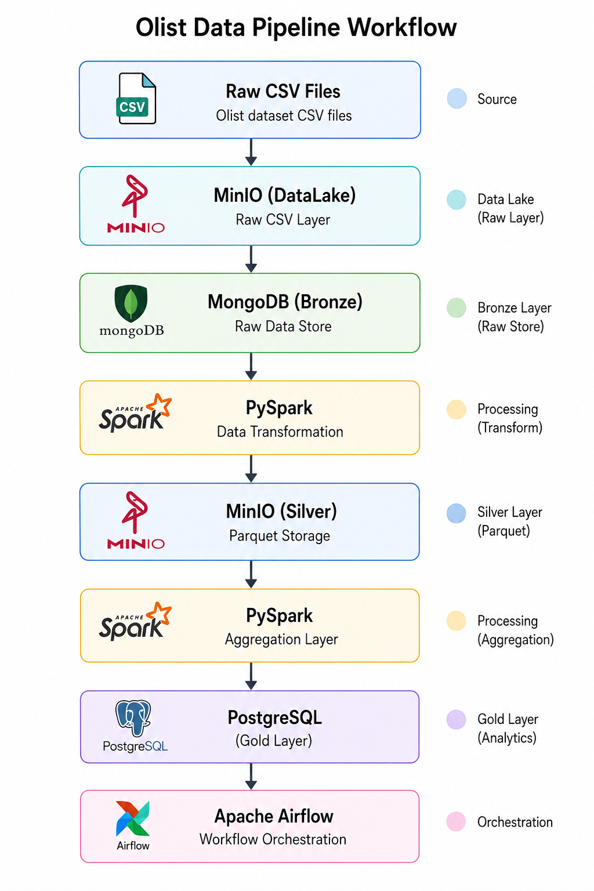

# etl-project

                +-------------------+
                |   Raw CSV Files   |
                +-------------------+
                          |
                          v
                +-------------------+
                |  MinIO (DataLake) |
                |   Raw CSV Layer   |
                +-------------------+
                          |
                          v
                +-------------------+
                |  MongoDB (Bronze) |
                |   Raw Data Store  |
                +-------------------+
                          |
                          v
                +-------------------+
                |      PySpark      |
                | Data Transformation|
                +-------------------+
                          |
                          v
                +-------------------+
                |  MinIO (Silver)   |
                |  Parquet Storage  |
                +-------------------+
                          |
                          v
                +-------------------+
                |      PySpark      |
                | Aggregation Layer |
                +-------------------+
                          |
                          v
                +-------------------+
                |   PostgreSQL      |
                |   (Gold Layer)    |
                +-------------------+
                          |
                          v
                +-------------------+
                | Apache Airflow    |
                | Workflow Orchestration |
                +-------------------+
