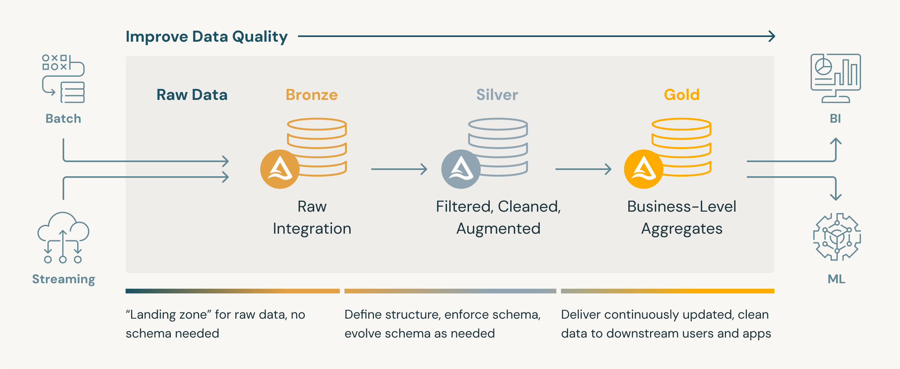
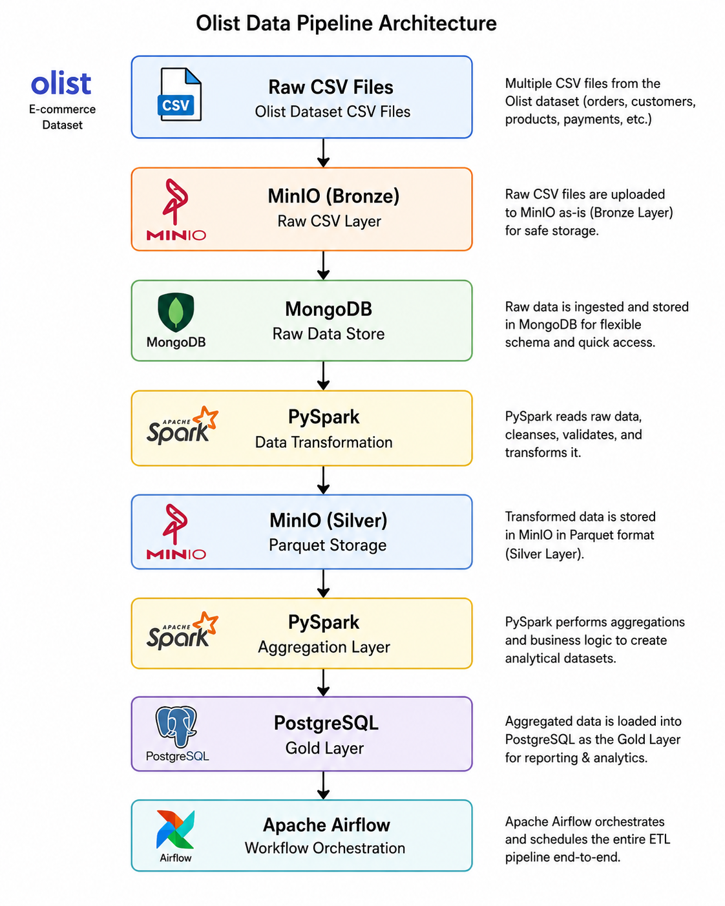

# Olist ETL Data Pipeline

This repository contains an end-to-end ETL pipeline for the Brazilian Olist ecommerce dataset. It uses Apache Airflow for orchestration, MinIO as an S3-compatible data lake, MongoDB as the bronze/raw store, PySpark for transformation and aggregation, and PostgreSQL for the gold analytics layer.





## Project Overview

The pipeline follows a medallion-style architecture:

1. Raw CSV files are stored in `olist_dataset/`.
2. CSV files are uploaded to MinIO under the `bronze/` path.
3. Bronze data is loaded from MinIO into MongoDB collections.
4. PySpark reads MongoDB, joins and cleans the data, and writes a silver Parquet dataset to MinIO.
5. PySpark reads the silver dataset, builds analytics-ready gold tables, and loads them into PostgreSQL.
6. Apache Airflow runs the full workflow.

## Tech Stack

| Component | Purpose |
| --- | --- |
| Docker Compose | Runs the local platform |
| Apache Airflow | Orchestrates ETL tasks |
| MinIO | S3-compatible data lake |
| MongoDB | Bronze/raw document store |
| PySpark | Silver transformation and gold aggregation |
| PostgreSQL | Gold analytics warehouse |
| Pandas | Helper processing before PostgreSQL loading |

## Repository Structure

```text
.
|-- dags/
|   `-- etl_pipeline.py
|-- ingestion/
|   |-- ingest_to_minio.py
|   `-- ingest_to_mongo.py
|-- spark_jobs/
|   |-- transform.py
|   `-- aggregate.py
|-- olist_dataset/
|-- notebooks/
|-- assets/
|-- docker-compose.yml
|-- dockerfile
|-- example.env
`-- README.md
```

## Pipeline Flow

```text
Local CSV files
    -> MinIO bronze layer
    -> MongoDB bronze collections
    -> PySpark transformation
    -> MinIO silver Parquet dataset
    -> PySpark aggregation
    -> PostgreSQL gold tables
```

The Airflow DAG is defined in `dags/etl_pipeline.py` and runs these tasks:

1. `ingest_datalake`
2. `ingest_bronze`
3. `transform_silver`
4. `aggregate_gold`

## Dataset

The active pipeline uses:

| File | Purpose |
| --- | --- |
| `olist_orders_dataset.csv` | Order metadata and status |
| `olist_customers_dataset.csv` | Customer city and state |
| `olist_order_items_dataset.csv` | Order item and product links |
| `olist_products_dataset.csv` | Product categories |
| `olist_order_payments_dataset.csv` | Payment type and payment value |

Other included files can support future seller, review, geolocation, and category translation analysis.

## Gold Tables

The gold layer now writes multiple PostgreSQL tables:

| Table | Grain | Purpose |
| --- | --- | --- |
| `revenue_by_state` | Customer state | Total payment revenue by state |
| `monthly_revenue` | Order month | Monthly revenue trend and order count |
| `top_product_categories` | Product category | Product revenue, item count, and order count |
| `orders_by_status` | Order status | Order count and revenue by order status |
| `customer_state_summary` | Customer state | Customer count, order count, and revenue by state |
| `payment_type_summary` | Payment type | Order count and payment value by payment method |

Payment-based tables are built from distinct order-payment rows so order revenue is not multiplied by the number of items in an order. Product-category revenue is built from distinct order-item rows using item price.

## Local Services

| Service | URL | Purpose |
| --- | --- | --- |
| Apache Airflow | `http://localhost:8080` | DAG orchestration UI |
| MinIO Console | `http://localhost:9001` | Data lake web UI |
| MinIO API | `http://localhost:9000` | S3-compatible endpoint |
| MongoDB | `mongodb://localhost:27017` | Bronze/raw data storage |
| PostgreSQL | `postgresql://localhost:5432` | Gold warehouse |

## Setup

Copy the environment template:

```powershell
Copy-Item example.env .env
```

Or on macOS/Linux:

```bash
cp example.env .env
```

Update `.env` values as needed:

```env
MINIO_ENDPOINT=minio:9000
MINIO_ACCESS_KEY=your-access-key
MINIO_SECRET_KEY=your-secret-key
MINIO_BUCKET=olist-data

MONGO_URI=mongodb://mongodb:27017/
MONGO_DB=olist

POSTGRES_HOST=postgres
POSTGRES_DB=olist
POSTGRES_USER=postgres
POSTGRES_PASSWORD=your-password
POSTGRES_PORT=5432

AIRFLOW_USER=admin
AIRFLOW_PASSWORD=admin
AIRFLOW_EMAIL=admin@example.com
AIRFLOW_DB=sqlite:////opt/airflow/airflow.db
AIRFLOW_FERNET_KEY=your-fernet-key
```

Generate an Airflow Fernet key with:

```bash
python -c "from cryptography.fernet import Fernet; print(Fernet.generate_key().decode())"
```

Start the stack:

```bash
docker compose up --build
```

Then open Airflow at:

```text
http://localhost:8080
```

Enable and trigger the `olist_etl_pipeline` DAG.

## Manual Task Order

The pipeline is intended to run through Airflow, but the scripts run in this order:

```bash
python ingestion/ingest_to_minio.py
python ingestion/ingest_to_mongo.py
python spark_jobs/transform.py
python spark_jobs/aggregate.py
```

When running scripts outside Docker, change service hostnames in `.env` from Docker names such as `minio`, `mongodb`, and `postgres` to local addresses such as `localhost`.

## Troubleshooting

If Airflow cannot connect to MinIO, keep the Docker endpoint as:

```env
MINIO_ENDPOINT=minio:9000
```

If scripts are run directly from the host machine, use:

```env
MINIO_ENDPOINT=localhost:9000
MONGO_URI=mongodb://localhost:27017/
POSTGRES_HOST=localhost
```

If a gold table is empty, check that:

1. CSV files were uploaded to MinIO under `bronze/`.
2. MongoDB collections were populated.
3. Silver Parquet exists at `s3a://olist-data/silver/fact_orders`.
4. The `aggregate_gold` task completed successfully.

## Possible Improvements

- Add data quality checks before writing silver and gold data.
- Add dbt models on top of PostgreSQL.
- Add more gold tables for seller, review, and delivery analysis.
- Add tests for ingestion, transformation, and aggregation logic.
- Add a dashboard connected to PostgreSQL.
